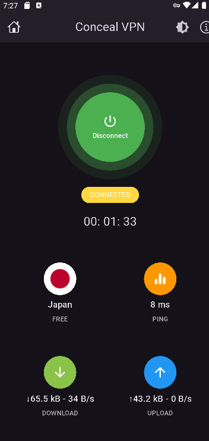
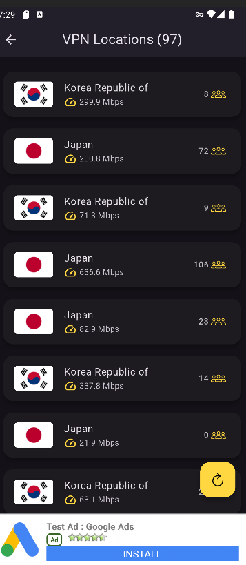
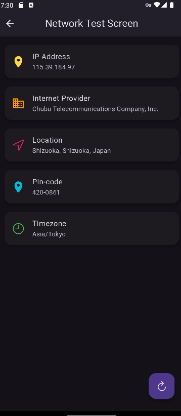

# Conceal VPN

**Conceal VPN** is a secure and private VPN application that utilizes **OpenVPN servers** from the **VPN Gate** project. Built with **Flutter**, it employs **GetX** for state management, **Hive** for caching, and integrates **Google Ads** for monetization.

## Features

✅ **Secure OpenVPN Connection** – Connect to VPN Gate’s free OpenVPN servers.
✅ **Fast & Reliable** – Optimized performance with a lightweight architecture.
✅ **State Management with GetX** – Efficient and reactive UI updates.
✅ **Offline Caching with Hive** – Faster connection retrieval and improved user experience.
✅ **Google Ads Integration** – Monetization through ads without compromising user privacy.
✅ **User-Friendly UI** – Simple and intuitive design for easy navigation.
✅ **No Registration Required** – Connect instantly without creating an account.

## Screenshots

## Screenshots

| Home Screen                                  | Server Selection                             | Connection Status                    |
|----------------------------------------------|----------------------------------------------|--------------------------------------|
|  |  |  |


## Installation

### Prerequisites
- Flutter (latest stable version)
- Android Studio or Visual Studio Code
- Dart SDK

### Clone the Repository
```sh
 git clone https://github.com/AdilMulimani/ConcealVPN
 cd ConcealVPN
```

### Install Dependencies
```sh
 flutter pub get
```

### Run the App
```sh
 flutter run
```

## Technologies Used
- **Flutter** – Cross-platform framework
- **Dart** – Programming language
- **GetX** – State management & dependency injection
- **Hive** – Local caching for improved performance
- **OpenVPN** – Secure VPN protocol
- **VPN Gate API** – Fetching free OpenVPN servers
- **Google Ads** – Monetization through AdMob

## Contributing
We welcome contributions! Please follow these steps:
1. Fork the repository
2. Create a new branch (`feature/new-feature`)
3. Commit your changes
4. Push to your branch
5. Open a pull request

## Contact
📧 **Email**: adilmulimani@gmail.com
---

Give a ⭐ if you like the project! 🚀

